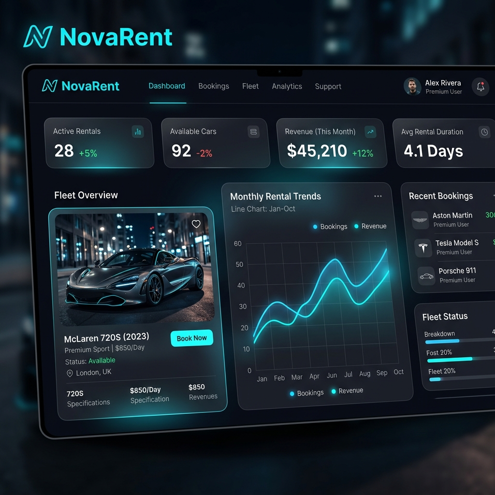

# NovaRent - Premium Car Rental Management System

<p align="center">
  
</p>

<p align="center">
  
  
  
  
</p>

NovaRent is a web-based vehicle rental management platform designed to automate booking pipelines and simplify fleet management. Built using **Django** and **SQLite** with a premium, responsive **custom Dark Glassmorphism CSS theme**, the system provides specialized portals for both customers and administrators.

---

## 🌟 Key Features

### 🚗 Customer Portal
- **Interactive Homepage**: Dynamic search filtering by keyword, brand, and fuel type, coupled with featured fleet highlights, a newsletter subscriber form, and customer testimonials.
- **Advanced Catalog Filtering**: A sidebar control panel to filter vehicles by brand, fuel types, seating capacity, price limit, and keywords.
- **Interactive Booking Panel**: Implements **live AJAX availability checks** on date inputs, dynamically calculating total cost.
- **Client Dashboard**: A centralized panel to manage profile settings, update security credentials, submit testimonials, and view booking history (with cancellations for pending reservations).

### 🛠️ Custom Admin Control Center
- **Performance Overview**: Operational counters tracking fleet volume, users, active bookings, and queries.
- **Fleet & Brand CRUD**: Comprehensive add, edit, and delete interfaces for vehicle listings and manufacturer brands.
- **Booking Manager**: Status controls to review, approve, reject, or cancel all customer reservations.
- **Testimonial Moderation**: Toggle customer feedback visibility on the landing page.
- **Contact & Subscription logs**: Access queries submitted via the contact form and view newsletter subscriber lists.
- **Content Editor**: Update static page text (About Us, Terms) and global footer configuration.

---

## 🛠️ Technology Stack

- **Backend**: Python, Django 6.0.5, Django ORM
- **Database**: SQLite (local development database)
- **Frontend**: HTML5, Vanilla CSS3 (Custom Glassmorphism UI), JavaScript, Font Awesome Icons

---

## 📂 Project Structure

```text
car_rental_system/
├── car_rental/          # Django project configuration (settings, URLs, WSGI)
├── rentals/             # Django app core
│   ├── management/      # Custom django-admin commands (database seeders)
│   ├── migrations/      # Database scheme histories
│   ├── static/          # Custom CSS styles
│   ├── templates/       # Glassmorphism HTML templates
│   ├── models.py        # Relational models definitions
│   ├── views.py         # Request controllers & actions
│   └── tests.py         # Automated unit test suite
├── static/              # Global static directory placeholder
├── manage.py            # Django CLI entrypoint
└── db.sqlite3           # Local SQLite database (git-ignored)
```

---

## ⚡ Seed User Accounts & Roles

The system is seeded with mock data:

| Username | Password | Role | Access Level |
| :--- | :--- | :--- | :--- |
| **`admin`** | **`admin123`** | **Staff / Superuser** | Full access to the custom **Admin Control Portal** |
| **`john_doe`** | **`password123`** | **Customer** | Client Portal, Booking, Profiles & Reviews |
| **`jane_smith`** | **`password123`** | **Customer** | Client Portal, Booking, Profiles & Reviews |

---

## 🚀 Setup & Installation Instructions

Follow these steps to run NovaRent locally:

### 1. Clone the Repository
```bash
git clone https://github.com/YOUR_USERNAME/novarent-car-rental.git
cd novarent-car-rental
```

### 2. Create and Activate Virtual Environment
```bash
# On Windows
python -m venv venv
venv\Scripts\activate

# On macOS/Linux
python3 -m venv venv
source venv/bin/activate
```

### 3. Install Dependencies
```bash
pip install django pillow
```

### 4. Apply Migrations & Seed Database
```bash
python manage.py migrate
python manage.py seed_data
```

### 5. Launch the Server
```bash
python manage.py runserver
```
Visit **`http://127.0.0.1:8000/`** in your browser!

---

## 🧪 Running Unit Tests

Automated testing is configured to check models, permissions, and booking logic. To run the test suite:
```bash
python manage.py test rentals
```
